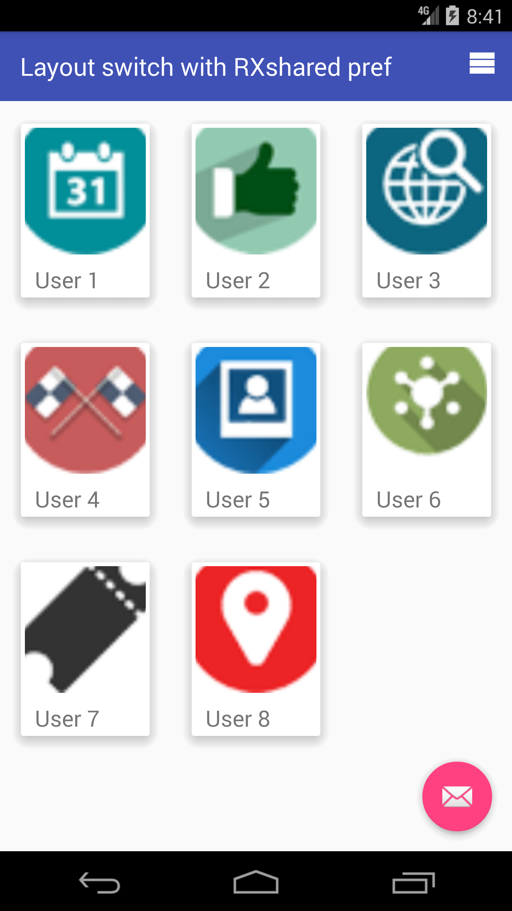
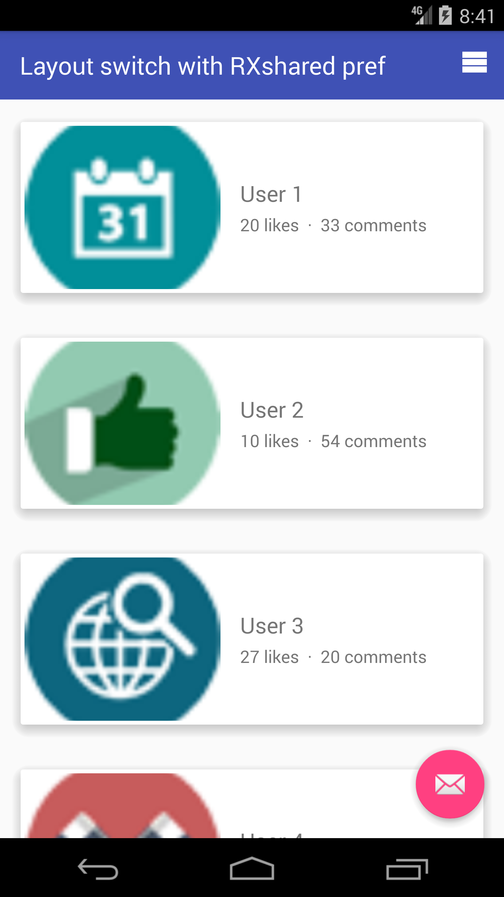

# Layout switch RXshared pref

Android RecyclerView: Change layout Manager file LIST to GRID and save result in RXShared preference .</br>
<a href='https://ko-fi.com/A243447K' target='_blank'></a><br>

# Preview :

* Grid layout :</br>


* List layout :</br>

<br>

# Code in Java:

* Init RxSharedpref :
```java
 sharedPreferences = getSharedPreferences("prefs", Context.MODE_PRIVATE);
        rxShared = RxSharedPreferences.with(sharedPreferences);

        rxShared.getInt("span", 0)
                .subscribe(span_count -> {
                    //Get Span Count
                    Log.d("Get pref", "SPAN: " + span_count);
                    if(span_count.equals(0))
                    {
                     // If Span Count 0 Replace With 1
                        rxShared.putString("app_name","layout_switch_RXShared_Pref")
                                .flatMap(span_c ->rxShared.putInteger("span",SPAN_COUNT_ONE))
                                .flatMap(span_name ->rxShared.putString("span.name","Single"))
                                .flatMap(span_item -> rxShared.getAll())
                                .flatMap(integerMap -> Observable.fromIterable(integerMap.entrySet()))
                                .map(Object::toString)

                                .subscribe(s -> Log.d("TAG 1", s));
                    }
                });


        Observable.just(new PrefItem())
                .flatMap(prefItem -> rxShared.getInt("span", 1), (prefItem, sp) -> {
                    prefItem.setSpan_count(sp);
                    return prefItem;
                })

                .flatMap(prefItem -> rxShared.getString("span.name", ""), (prefItem, sp) -> {
                    prefItem.setSpan_name(sp);
                    return prefItem;
                })

                .subscribe(prefItem -> {
                    Log.d("TAG 3 NUM:", String.valueOf(prefItem.getSpan_count()));
                    Log.d("TAG 3 NAME:", prefItem.getSpan_name());
                    //Get span From RXPref to Layout Manager
                    gridLayoutManager = new GridLayoutManager(this, prefItem.getSpan_count());
                });

```
* Function to switch Layout :
```java
private void switchLayout() {
        if (gridLayoutManager.getSpanCount() == SPAN_COUNT_ONE) {
            gridLayoutManager.setSpanCount(SPAN_COUNT_THREE);

            rxShared.putString("app_name","layout_switch_RXShared_Pref")
                    .flatMap(span_count ->rxShared.putInteger("span",SPAN_COUNT_THREE))
                    .flatMap(span_name ->rxShared.putString("span.name","Multiple"))
                    .flatMap(span_item -> rxShared.getAll())
                    .flatMap(integerMap -> Observable.fromIterable(integerMap.entrySet()))
                    .map(Object::toString)

                    .subscribe(s -> Log.d("Switch_layout 3:", s));


        } else {
            gridLayoutManager.setSpanCount(SPAN_COUNT_ONE);

            rxShared.putString("app_name","layout_switch_RXShared_Pref")
                    .flatMap(span_count ->rxShared.putInteger("span",SPAN_COUNT_ONE))
                    .flatMap(span_name ->rxShared.putString("span.name","Single"))
                    .flatMap(span_item -> rxShared.getAll())
                    .flatMap(integerMap -> Observable.fromIterable(integerMap.entrySet()))
                    .map(Object::toString)

                    .subscribe(s -> Log.d("Switch_layout 1:", s));


        }
        itemAdapter.notifyItemRangeChanged(0, itemAdapter.getItemCount());
    }
```
# SDK Required
+ Target sdk:<br>
[](https://android-arsenal.com/api?level=23)
+ Min sdk:<br>
[](https://android-arsenal.com/api?level=19)

# Linkedin

<a href="https://www.linkedin.com/in/soussimohamed/">

</a>

# Licence

```
Copyright 2017 Soussidev, Inc.

Licensed under the Apache License, Version 2.0 (the "License");
you may not use this file except in compliance with the License.
You may obtain a copy of the License at

   http://www.apache.org/licenses/LICENSE-2.0

Unless required by applicable law or agreed to in writing, software
distributed under the License is distributed on an "AS IS" BASIS,
WITHOUT WARRANTIES OR CONDITIONS OF ANY KIND, either express or implied.
See the License for the specific language governing permissions and
limitations under the License.
```

